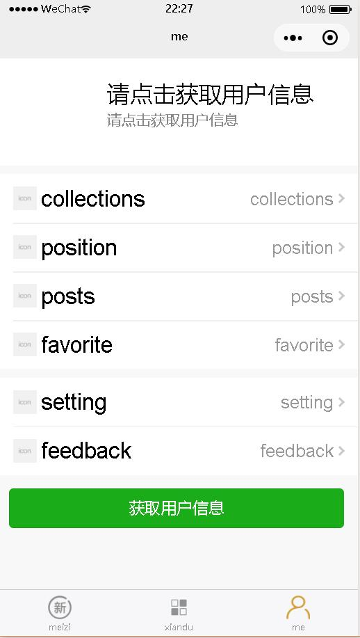

# MeiZiTu
学习微信小程序时所写的小程序，首页为从https://gank.io/api 获取的妹子图，me选项卡中是个人信息页面，包含了从微信获取的用户信息  
### 更新
**18.9.20**  
完善了me选项卡UI，并可获取用户信息  

**18.9.24**  
给me选项卡中的选项加了跳转页面

**18.9.25**  
干了什么忘了  

**18.9.27**  
给xiandu选项卡的xiandu-items的detail页面加了webview，也就是说可以愉快地看资讯了  
但是不会用css3 animation，得去学了  
添加个预览图吧

### 预览

